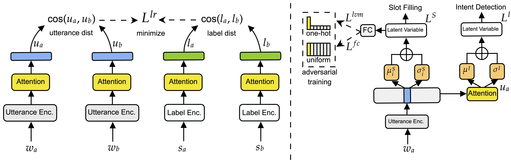

# Cross-lingual Spoken Language Understanding with Regularized Representation Alignment

 [](https://opensource.org/licenses/MIT)


This repository is for the EMNLP-2020 paper: [Cross-lingual Spoken Language Understanding with Regularized Representation Alignment](https://arxiv.org/pdf/2009.14510.pdf)

This code has been written using PyTorch. If you use any source codes or ideas included in this repository for your work, please cite the following paper.
</pre>
@inproceedings{liu2020cross,
  title={Cross-lingual Spoken Language Understanding with Regularized Representation Alignment},
  author={Liu, Zihan and Winata, Genta Indra and Xu, Peng and Lin, Zhaojiang and Fung, Pascale},
  booktitle={Proceedings of the 2020 Conference on Empirical Methods in Natural Language Processing (EMNLP)},
  pages={7241--7251},
  year={2020}
}
</pre>

## Abstract
Despite the promising results of current cross-lingual models for spoken language understanding systems, they still suffer from imperfect cross-lingual representation alignments between the source and target languages, which makes the performance sub-optimal. To cope with this issue, we propose a regularization approach to further align word-level and sentence-level representations across languages without any external resource. First, we regularize the representation of user utterances based on their corresponding labels. Second, we regularize the latent variable model (Liu et al., 2019) by leveraging adversarial training to disentangle the latent variables. Experiments on the cross-lingual spoken language understanding task show that our model outperforms current state-of-the-art methods in both few-shot and zero-shot scenarios, and our model, trained on a few-shot setting with only 3% of the target language training data, achieves comparable performance to the supervised training with all the training data.

## Model Illustration


## Data
We evaluate our system on multilingual task-oriented dialogue dataset Published by [Schuster et al. (2019)](https://www.aclweb.org/anthology/N19-1380.pdf), which contains Dialog Natural Language Understanding data in English, Spanish and Thai. We put this dataset in the data folder under this repository. We also include the splited 1%, 3% and 5% data in Spanish for the few-shot cross-lingual experiments.

## How to run
### Configuration
- ```--trans_lang:``` Target language
- ```--prop:``` Proportion of the target language samples (0.01, 0.03, 0.05)
- ```--la_reg:``` Use label regularization
- ```--pretr_la_enc:``` Pretrain label encoder
- ```--adv:``` Add adversarial training to LVM

### BiLSTM-ALVM + LR
1% few-shot to Spanish
```console
❱❱❱ python main.py --exp_name bilstm_alvm_lr_delex --exp_id es --bidirection --trans_lang es --emb_file_trans ./emb/refine.es.align.en-es.vec --emb_file_en ./emb/refine.en.align.en-es.vec --trim --prop 0.01 --lvm --lvm_dim 150 --la_reg --pretr_la_enc --pretr_epoch 10 --clean_txt --adv
```

1% few-shot to Thai
```console
❱❱❱ python main.py --exp_name bilstm_alvm_lr_delex --exp_id th --bidirection --trans_lang th --emb_file_trans ./emb/refine.th.align.en-th.vec --emb_file_en ./emb/refine.en.align.en-th.vec --trim --prop 0.01 --lvm --lvm_dim 150 --la_reg --pretr_la_enc --pretr_epoch 10 --clean_txt --adv --ckpt_labelenc pretrained/label_encoder.pth
```

Zero-shot to Spanish
```console
❱❱❱ python main.py --exp_name zs_xlslu_lr_alvm --exp_id es --bidirection --trans_lang es --emb_file_trans ./emb/refine.es.align.en-es.vec --emb_file_en ./emb/refine.en.align.en-es.vec --lvm --lvm_dim 150 --la_reg --adv --embnoise --clean_txt --zs --pretr_la_enc --pretr_epoch 10
```

Zero-shot to Thai
```console
python main.py --exp_name zs_xlslu_lr_alvm --exp_id th --bidirection --trans_lang th --emb_file_trans ./emb/refine.th.align.en-th.vec --emb_file_en ./emb/refine.en.align.en-th.vec --lvm --lvm_dim 150 --la_reg --adv --embnoise --clean_txt --zs --pretr_la_enc --pretr_epoch 10 --ckpt_labelenc pretrained/label_encoder.pth
```
